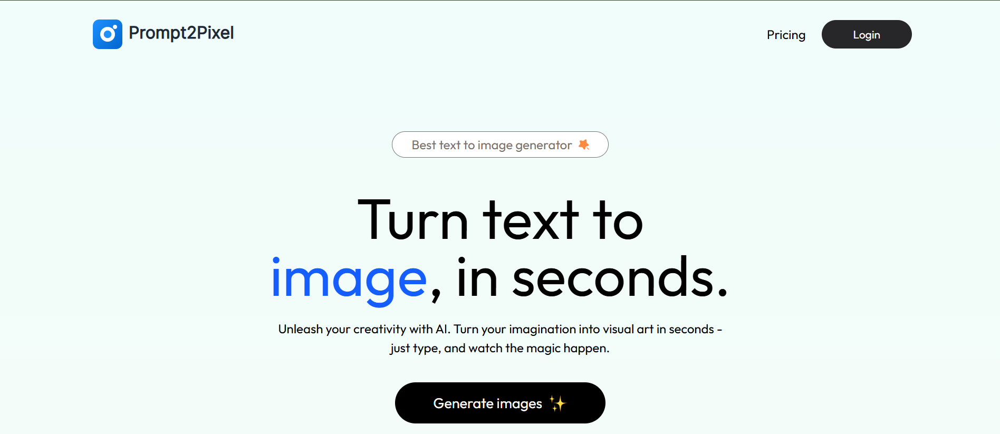
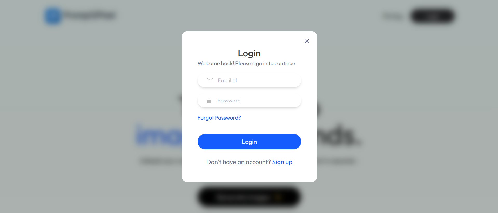
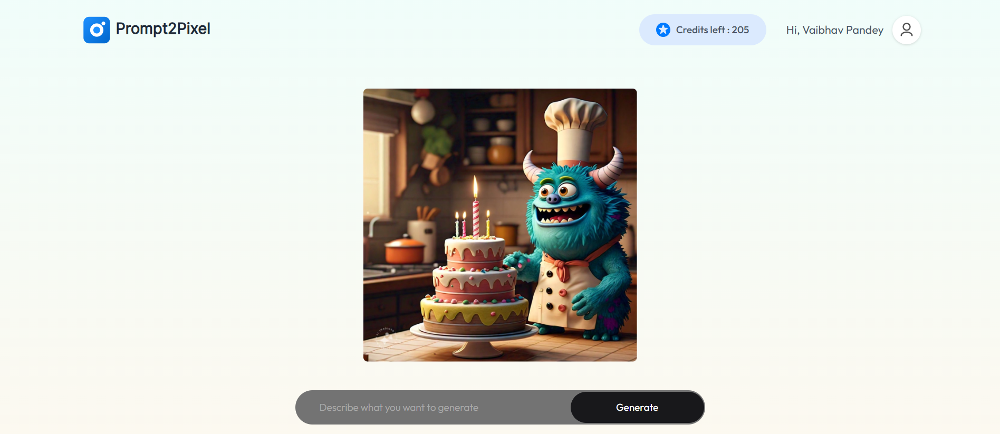
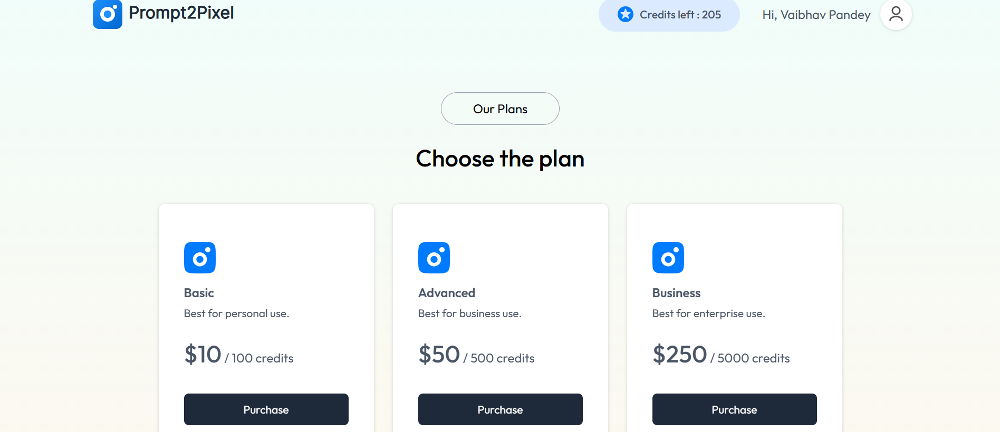

# 🎨 Prompt2Pixel

An AI-powered SaaS platform that transforms text prompts into stunning AI-generated images using the ClipDrop API. Built with the MERN Stack, Prompt2Pixel offers secure authentication, credit-based image generation, and seamless online payments through Razorpay.

---

## 🚀 Live Demo

- Frontend: https://prompt-2-pixel.vercel.app/
- Backend: https://prompt2pixel-backend.onrender.com/

---

## 📸 Screenshots

### Home Page



### Login Page



### Image Generation Page



### Payment Page



---

## 📖 Overview

Prompt2Pixel is a full-stack AI SaaS application that allows users to generate high-quality images from text prompts. The platform follows a credit-based system where users can purchase credits using Razorpay and spend them to generate AI images.

---

## ✨ Features

### 🔐 Authentication & Security
- User Registration & Login
- JWT Authentication
- Protected Routes
- Forgot Password Functionality
- Password Reset via Email

### 🎨 AI Image Generation
- Generate images from text prompts
- Powered by ClipDrop API
- Fast and efficient image rendering
- Download generated images

### 💳 Credit Management
- Credit-based usage system
- Track available credits
- Automatic credit deduction per generation

### 💰 Razorpay Integration
- Secure payment processing
- Purchase credits online
- Transaction management

### 📱 Responsive UI
- Modern React UI
- Mobile-friendly design
- Smooth user experience

---

## 🛠️ Tech Stack

### Frontend
- React.js
- Vite
- React Router DOM
- Axios
- Context API
- Tailwind CSS

### Backend
- Node.js
- Express.js
- MongoDB Atlas
- Mongoose
- JWT
- Nodemailer

### APIs & Services
- ClipDrop API (AI Image Generation)
- Razorpay API (Payments)

### Deployment
- Vercel (Frontend)
- Render (Backend)
- MongoDB Atlas (Database)

---

## 📂 Project Structure

```text
Prompt2Pixel
│
├── LICENSE
├── README.md
├── .gitignore
├── package.json
├── package-lock.json
│
├── screenshots
│   ├── home.png
│   ├── login.png
│   ├── payment.png
│   └── generate-image.png
│
├── client
│   ├── public
│   │   ├── favicon.svg
│   │   └── assets
│   │
│   ├── src
│   │   ├── assets
│   │   │   ├── assets.js
│   │   │   └── images
│   │   │
│   │   ├── components
│   │   │   ├── Description.jsx
│   │   │   ├── Footer.jsx
│   │   │   ├── GenerateBtn.jsx
│   │   │   ├── Header.jsx
│   │   │   ├── Login.jsx
│   │   │   ├── NavBar.jsx
│   │   │   ├── Steps.jsx
│   │   │   └── Testimonials.jsx
│   │   │
│   │   ├── context
│   │   │   └── AppContext.jsx
│   │   │
│   │   ├── pages
│   │   │   ├── Home.jsx
│   │   │   ├── Result.jsx
│   │   │   ├── BuyCredit.jsx
│   │   │   └── ResetPassword.jsx
│   │   │
│   │   ├── App.jsx
│   │   ├── main.jsx
│   │   └── index.css
│   │
│   ├── .env
│   ├── package.json
│   ├── package-lock.json
│   └── vite.config.js
│
├── server
│   ├── config
│   │   └── mongodb.js
│   │
│   ├── controllers
│   │   ├── userController.js
│   │   ├── imageController.js
│   │   ├── forgotPassController.js
│   │   └── resetPassController.js
│   │
│   ├── middlewares
│   │   └── auth.js
│   │
│   ├── models
│   │   ├── userModel.js
│   │   └── transactionModel.js
│   │
│   ├── routes
│   │   ├── userRoutes.js
│   │   └── imageRoutes.js
│   │
│   ├── server.js
│   ├── .env
│   ├── package.json
│   └── package-lock.json
│
└── node_modules (ignored)
```

---

## 🏗️ System Architecture

```text
User
  │
  ▼
React Frontend
  │
  ▼
Express Backend
  │
  ├── MongoDB Atlas
  ├── ClipDrop API
  └── Razorpay API
```

---

## ⚙️ Environment Variables

### Frontend (.env)

```env
VITE_BACKEND_URL=
VITE_RAZORPAY_KEY_ID=
```

### Backend (.env)

```env
MONGODB_URI=
JWT_SECRET=

RAZORPAY_KEY_ID=
RAZORPAY_SECRET=

CLIPDROP_API_KEY=

EMAIL_USER=
EMAIL_PASS=

FRONTEND_URL=
```

---

## 🚀 Getting Started

### Clone Repository

```bash
git clone https://github.com/your-username/Prompt2Pixel.git
cd Prompt2Pixel
```

### Install Frontend Dependencies

```bash
cd client
npm install
```

### Install Backend Dependencies

```bash
cd ../server
npm install
```

### Run Backend

```bash
npm run server
```

### Run Frontend

```bash
cd ../client
npm run dev
```

---

## 🔒 Security Features

- JWT Authentication
- Protected Routes
- Environment Variable Protection
- Secure Payment Integration
- Password Reset via Email
- MongoDB Atlas Security

---

## 📈 Future Enhancements

- AI Image History
- User Dashboard
- Multiple AI Models
- Subscription Plans
- Image Variations
- Admin Panel
- Social Sharing Features

---

## 👨‍💻 Author

**Vaibhav Pandey**

- B.Tech Computer Science & Engineering
- Full Stack Developer
- MERN Stack Developer
- AI Enthusiast

### Connect With Me

- LinkedIn: www.linkedin.com/in/vaibhav-pandey-a6b39a263
- GitHub: https://github.com/vaibhav21devlpr

---

## ⭐ Show Your Support

If you found this project helpful, please consider giving it a ⭐ on GitHub.

---

## 📄 License

This project is licensed under the MIT License.
